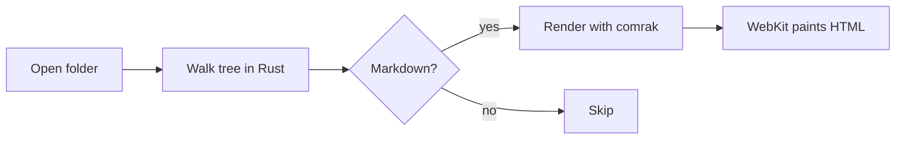
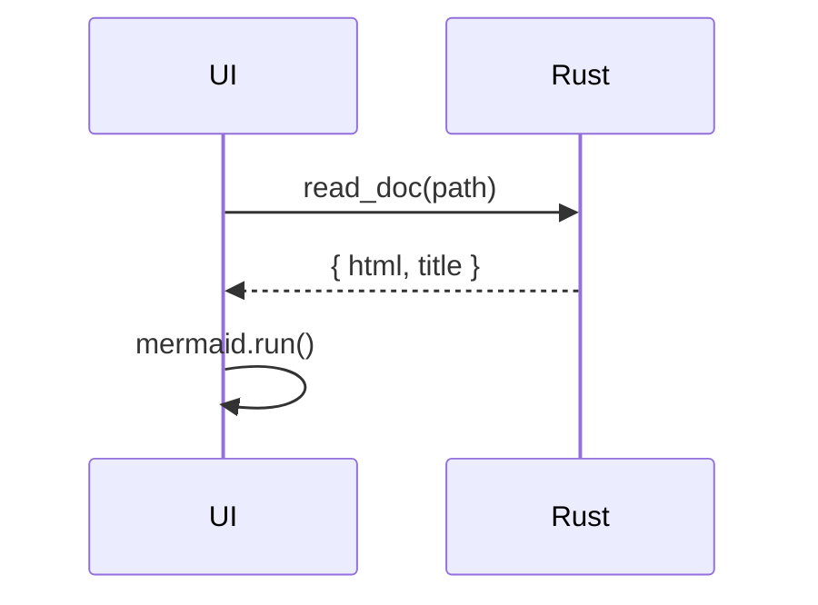

# Diagrams

Mermaid blocks render client-side, lazily loading the library only when a document needs it.

```mermaid
graph LR
  A[Open folder] --> B[Walk tree in Rust]
  B --> C{Markdown?}
  C -- yes --> D[Render with comrak]
  C -- no --> E[Skip]
  D --> F[WebKit paints HTML]
```

```mermaid
sequenceDiagram
  participant UI
  participant Rust
  UI->>Rust: read_doc(path)
  Rust-->>UI: { html, title }
  UI->>UI: mermaid.run()
```

Text after the diagrams still renders normally.
